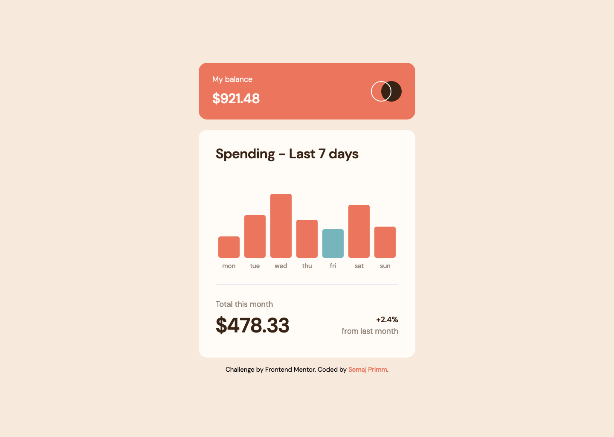
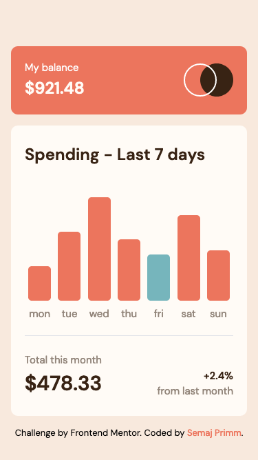

# Frontend Mentor - Expenses chart component solution

This is a solution to the [Expenses chart component challenge on Frontend Mentor](https://www.frontendmentor.io/challenges/expenses-chart-component-e7yJBUdjwt). Frontend Mentor challenges help you improve your coding skills by building realistic projects. 

## Table of contents

- [Overview](#overview)
  - [The challenge](#the-challenge)
  - [Screenshot](#screenshot)
  - [Links](#links)
- [My process](#my-process)
  - [Built with](#built-with)
  - [What I learned](#what-i-learned)
- [Author](#author)

## Overview

### The challenge

Users can:

- View the bar chart and hover over the individual bars to see the correct amounts for each day
- See the current day’s bar highlighted in a different colour to the other bars
- View the optimal layout for the content depending on their device’s screen size
- See hover states for all interactive elements on the page
- JSON data is used to dynamically size the bars on the chart

### Screenshot





### Links

- Solution URL: [github.com/semajthomasprimm/](https://your-solution-url.com)
- Live Site URL: [Add live site URL here](https://your-live-site-url.com)

## My process

### Built with

- [React](https://reactjs.org/) - JS library
- [TailwindCSS](https://tailwindcss.com/) - For styling
- Flexbox
- CSS Grid
- Mobile-first workflow

### What I learned

#### Custom TailwindCSS styles

I learned how to write custom Tailwind classes. I had values for padding, colors, font size, font weight, and border radius that differed from TailwindCSS default styling. I extended TailwindCSS' styles in tailwind.config.js. For example:

```js
theme: {
    extend: {
        ...
        colors: {
            'soft-red': '#EC755D',
            'cyan': '#76B5BC',
            'pale-cyan': '#B4E0E5',
        }
        ...
    }
}
```

#### Dynamically generate the bar height

To generate the height of each bar, I created a simple one-variable equation using the day amount and bar height in pixels (according to the design). Solving for x, I got the ratio to multiply each date amount and rounded up to the nearest whole number.
```js
const barHeight = `${Math.round(props.amount * 2.8661)}px`;
```
Using string templates, I was able to set the height with the calculated height. 
```jsx
<div 
    style={{height: barHeight}}
></div>
```

## Author

- Website - [Semaj Primm](https://www.semajprimm.com)
- Frontend Mentor - [@yourusername](https://www.frontendmentor.io/profile/semajthomasprimm)
